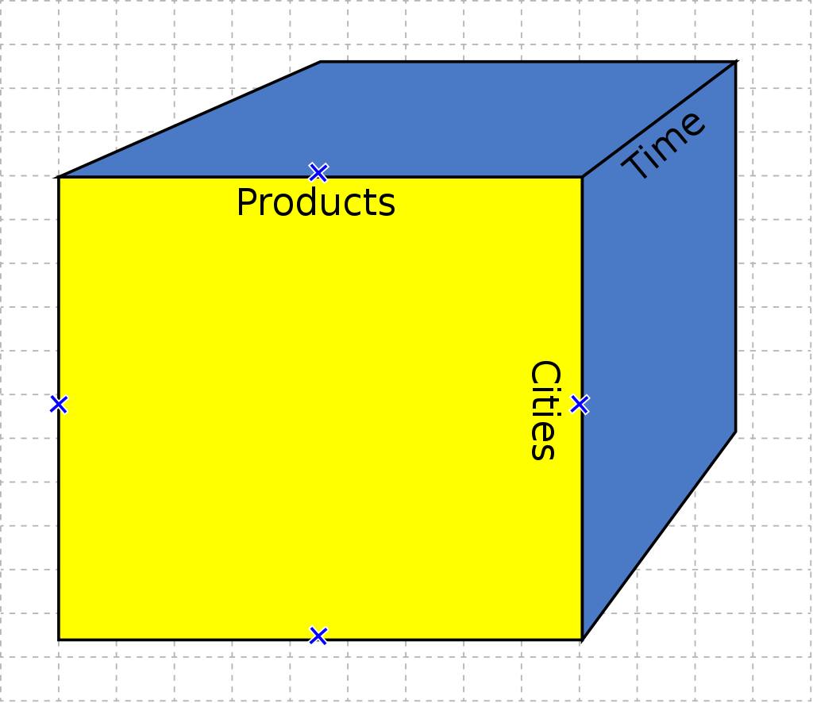
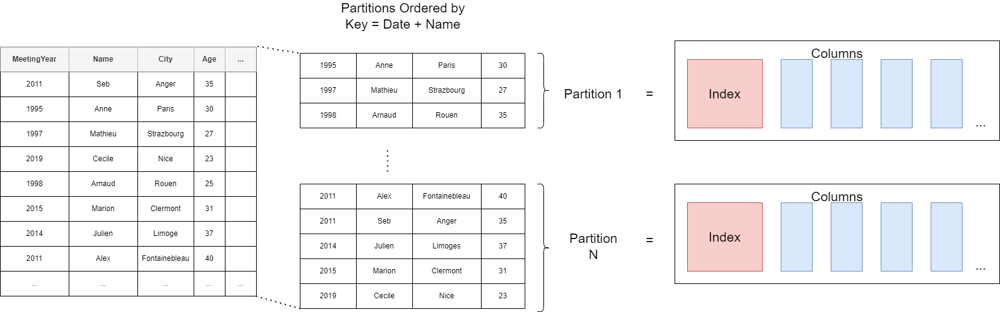

First article of the clickhouse 101 series. Lets deep dive into the underlying data structures and internal mechanisms of clickhouse.

Clickhouse is a DB that has a lot of potential and growing fast. Its use cases increase very rapidly as well. If you are into Data Analytics and Bigdata, you must explore it before too late.
This series of articles are meant to give an easy introduction to clickhouse to mainly junior level engineers, but you will still find interesting content if you are more experienced. 
The official documentation is evolving very fast. It is now complete in terms of content, and it is easier to read and browse through.  
So in this series we will be covering topics necessary knowledge before you dig into the official documentation, a résumé of most important points that differ clickhouse and that need attention, lastly and most importantly give experience based and neutral recommendations.

The series of articles will be as the following:
1. <a href="/clickhouse101_1">Clickhouse DataStructures and Internals</a>
2. Modeling your data in Clickhouse
3. Tradeoffs to take into account for Optimization 

In this first article, we will cover a bit of theory before getting into the practice. We will refresh our memory on the basics of DBs in general and the datastructures used in them. Lastly see how these structures are used in clickhouse and where does its power come from.   
We will cover the following topics:
1. <a href="#whatisCH" id="whatisCHref">What is Clickhouse ?</a>
2. <a href="#dsCH" id="dsCHref">Datastructures used in DBs and in Clickhouse</a>
3. <a href="#internalCH" id="internalCHref">Clickhouse internal Storage and Query Mechanisms</a>

---

<h1 id="whatisCH"> 1. What is Clickhouse ? </h1>

The best answer to that comes always from the [official documentation](https://clickhouse.com/docs/en/intro"):
<blockquote>
ClickHouse® is a high-performance, column-oriented SQL database management system (DBMS) for online analytical processing (OLAP). It is available as both an open-source software and a cloud offering.
</blockquote>

To describe its differences briefly:
* It is a true Column Based Database
* Uses data compression as a key role of its internal mechanism
* Stores data on disk
* Process data in blocks (similar data is stored together), in parallel (uses multicore CPUs) and has a distributed architecture (every instance is independent)
* Has SQL support (pretty much)
* Real time Data inserts (async data inserts do not block queries)
* It is Opensource

In order to understand it's true power and its differences from other DBs, lets first try to understand the basic concepts behind Column Oriented DBs and OLAP queries.

---

<h1 id="dsCH"> 2. Datastructures used in DBs and in Clickhouse</h1>
<h2> 2.1 Analytical Processing (OLAP) </h2>
Definition from [wikipedia](https://en.wikipedia.org/wiki/Online_analytical_processing):
<blockquote>OLAP (/ˈoʊlæp/), is an approach to answer multi-dimensional analytical (MDA) queries swiftly in computing.</blockquote>
Explained simply: It requires a system where we will insert new data very frequently, and want to query adhoc slices of it in real time. But never update the inserted data.

If we dig further:
* It requires scanning and aggregating large amount of data.  
Meaning that it is I/O and compute intensive (bottleneck is usually IO).
* Choosing different adhoc slices of data.  
Since we have lots of attributes and huge data, cache, index, pre-aggregation have limited value.
* Needs to deliver extremely fast response.  
Response required in as little as 20ms (Most of the time it is the backend for real-time applications)

These systems present the data to the user modelled as a [cube](https://en.wikipedia.org/wiki/OLAP_cube) in order to ease querying adhoc slices of it.
The term cube here refers to a multidimensional dataset, which is also sometimes called a <strong>hypercube</strong> if the number of dimensions is greater than three (which is usually the case).
It consists of numeric facts called measures that are categorized by dimensions. The measures are placed at the intersections of the hypercube, which is spanned by the dimensions as a vector space.

Let's say we have a dataset where our fact/measure is the sales of a company, and the dimensions (attributes) of it are time of the sale, product sold, and the city where it is sold.
Each cell of the cube holds a number that represents some measure of the business, such as sales, the 3 dimensions of our cube are the 3 attributes of our sale data.

Multiple standard operations of an OLAP cube exists to allow users analyse the data on all its aspects.
* Slicing/Dicing: Filtering the data on one or multiple specific value of one of its dimension. (ex: data for only the year 1989)
* Drill Down/Up: allows the user to navigate among levels of data ranging from the most summarized (up) to the most detailed (down). (ex: from outdoor sport equipments to individual products)
* Roll-up: Involves summarizing the data along a dimension. The summarization rule might be an aggregate function, such as computing totals along a hierarchy or applying a set of formulas such as "profit = sales - expenses"
* Pivot allows an analyst to rotate the cube in space to see its various faces. For example, cities could be arranged vertically and products horizontally while viewing data for a particular year

Olap systems under the hood, structures the DB tables in form of a [star schema](https://en.wikipedia.org/wiki/Star_schema) (other types of schemas exists, but similar).

Olap systems can have their data modeled in Clickhouse with this structure as well, but a simple and single flat table is more recommended. We will see why and how clickhouse allow this later in this post.  

Olap systems in order to give a cube like visualisation to the user on the UI or spreadsheet, based on the database structure under it, use an intermediate component that has a query engine generating the appropriate Queries (SQL for ClickHouse).
Some of the available solutions that provides the cube model on top of ClickHouse are [Cube](https://cube.dev/for/clickhouse-dashboard) and [Metabase](https://www.metabase.com/data_sources/click-house)(opensource), and [Opensee](https://opensee.io/) (tailored for financial institutions).

<h2> 2.2 How DBs work in general </h2>
Before we see how Column-Oriented DBs work (like clickhouse), lets refresh our memories on some base concepts necessary to understand how DBs store data, and how they look up for them when queried.

Lets illustrate how those work using the following DB table. 

<h3>Partitionning</h3> 
It allows a table to be subdivided and stored into smaller pieces, where each piece of such a database object is called a partition. Each partition has its own name, and may optionally have its own storage characteristics (maybe stored on separate physical or virtual disk for example). The data of partitioned tables is divided into units that can be spread across more than one filegroup in a database. The data is partitioned horizontally, so that groups of rows are mapped into individual partitions.

<h3>Indexing</h3>
I would like to state first the definition of the word ["index"](https://en.wikipedia.org/wiki/Index_(publishing)):
<blockquote>
An index is a list of words or phrases ('headings') and associated pointers ('locators') to where useful material relating to that heading can be found in a document or collection of documents. Examples are an index in the back matter of a book and an index that serves as a library catalog. An index differs from a word index, or concordance, in focusing on the subject of the text rather than the exact words in a text, and it differs from a table of contents because the index is ordered by subject, regardless of whether it is early or late in the book, while the listed items in a table of contents is placed in the same order as the book.[1]
</blockquote> 

Now we can understand its usage [in DBs](https://en.wikipedia.org/wiki/Database_index).
<blockquote>
A database index is a data structure that improves the speed of data retrieval operations on a database table at the cost of additional writes and storage space to maintain the index data structure.
</blockquote>

Indexes in DBs are created using the following two info:  
<strong>Search key:</strong> A copy of the primary key, the values of the search key is stored in sorted order to be able to search on them easily.  
<strong>Data ref:</strong> or pointer, which contains addresses of disk block where the value row of that particular key is stored.      
<em>NOTE: the pointed data itself may or may not be ordered.</em>

There exists two types of index file organisations:  
<strong> 1. Sequential file organisation </strong>  
<strong> 2. Hash file organisation </strong>

Lets illustrate how those organisations work using our DB table.

We will start with Hash file, and finish with Sequential file index, cause the latest is the one used in ClickHouse.

<strong>Hash file organisation:</strong>
Is an index that uses a hash function with search keys as parameters to generate the direct addresses of data record on disk.
We give the definition of a hash function later in this article.

As it is the case for all Hash based organisations, the data stored is scattered, non-ordered, so cannot be compressed. Lots of space is not used and wasted.

<strong>Sequential file index organisation:</strong>
In this, the indices are based on a sorted ordering of the values. These are generally fast and a more traditional type of storing mechanism. These Ordered or Sequential file organizations might store the data in a dense or sparse format.

<strong>Dense index: </strong>
We can see that the index has an entry for every first name in the table. If we want to look up a user with the first name "Arnaud," then we perform a binary search on the index and read the location of the data. In contrast, a sparse index only has entries for some of the table rows.

<strong>Sparse index:</strong>  
We can see that our sparse index only has 2 entries (one for each page). Now, if we want to find the row for "Arnaud," we can perform a binary search on our index to find that it falls between "Anne" and "Mathieu". After discovering those bounds, we go to the page starting with "Anne" and begin scanning for Arnaud's row. Notice that the data is now sorted on the right side for this example. This sorting is a limitation of the sparse index. A sparse index requires ordered data; otherwise, the scanning step would be impossible.

Dense indexes require more maintenance than sparse indexes at write-time. Since every row must have an entry, the database must maintain the index on inserts, updates, and deletes. Having an entry for every row also means that dense indexes will require more memory. The benefit of a dense index is that values can be quickly found with just a binary search. Dense indexes also do not impose any ordering requirements on the data.
Sparse indexes require less maintenance than dense indexes at write-time since they only contain a subset of the values. This lighter maintenance burden means that inserts, updates, and deletes will be faster. Having fewer entries also means that the index will use less memory. Finding data is slower since a scan across the page typically follows the binary search. Sparse indexes are also only an option when working with ordered data.

<h2> 2.3. How Row and Column based Databases work</h2>
Lets say we have the following DB table.

Row oriented DBs, as the name suggest, store data in rows. It is easy to write and read entire rows. But not so much if you want to read adhoc Query or do aggregation on particular columns, like analytical queries does. 
In that case you have to bring all columns for all rows, read multiple disks potentially, then filter on columns you are interested, then only aggregate.  

For example if we want to add a new row in a Row oriented DB, we would be appending the data like below.  
Reading from it would require reading all columns.

Now imagine if we just wanted to sum the ages in this table. We would have to read all data columns first to get the data we need. Also if we partition the table into multiple disks, this would mean that the computer would need to read from multiple disks to get the data necessary.  

Now lets compare the same scenario for the same data stored on a Column Oriented design.

If we want to add new data, we would have to plug each column's data into where it belongs. If we use a single disk, we would have to bring everything in memory to do this. But it is the same with Row Oriented design. Column Oriented design has its advantage if we partition data into multiple disks.  

As we can see from above, when reading a single column for aggregating on it, we just need one disk, and the data loaded in memory is much less.

Now, If we want to save space on our DB and secure data, we may consider data encoding and compression. So lets see what that means.

<h2> 2.4. Compression ? Encoding ? Encryption ? Hashing ? Indexing ? Huh ?!</h2>
Compression from [wikipedia](https://en.wikipedia.org/wiki/Data_compression):
<blockquote>
In information theory, data compression, source coding, or bit-rate reduction is the process of encoding information using fewer bits than the original representation. Any particular compression is either lossy or lossless. Lossless compression reduces bits by identifying and eliminating statistical redundancy. No information is lost in lossless compression. Lossy compression reduces bits by removing unnecessary or less important information.[3] Typically, a device that performs data compression is referred to as an encoder, and one that performs the reversal of the process (decompression) as a decoder.
</blockquote>
As the description above says, compression is a type of encoding. So lets start with that first.

<h3> What is Encoding ? </h3>
Encoding data is a process involving changing data into a new format using a scheme. Encoding is a reversible process and data can be encoded to a new format and decoded to its original format. Encoding typically involves a publicly available scheme that is easily reversed. Encoding data is typically used to ensure the integrity and usability of data and is commonly used when data cannot be transferred in its current format between systems or applications. Encoding is not used to protect or secure data because it is easy to reverse.  

<strong>An example of encoding - Base64  </strong>
It is a method to encode byte sequences to a string. Also known as ASCII encoding, it converts binary data to ASCII strings.
But it is not the ideal choice for security as it can easily be decoded.
Instead, it serves as an easy way to make non HTTP compatible data types readable (image, audio ect...)
We can attach a base64 encoded image into an xml or email.
It provides no checksum or anything for storage value, so it is really used for transport.

<strong> Another example of encoding - UTF </strong>
It is a method used for storage. 
UTF Stands for "Unicode Transformation Format". The UTF encoding standards, such as UTF-8, 16 ect., are used to convert Unicode character into numerals. <strong>Unicode</strong> is a codded character set. A set of characters and mapping between those characters and their integer codes representing them.

Lets say we want to store the following character in our hard drive.


character:              汉
unicode:                U+6C49
unicode in binary:      01101100  01001001


When we decide to store a character in our hard drive, we can simply put its binary value. When the computer reads it, it has no idea how to parse this. It is one byte 2 charcter ? or two bytes 1 character ? so we need an encoding to tell the computer how to treat it when read. This is where UTF-8 like encodings comes in.  

Binary Format of Byte Sequences in UTF-8 are like the following:

Which format from the above table we will use depends on how many bits we need to write in binary the unicode of our character (for 汉 we need 2bytes/16bits).    
So to Encode 汉 in UTF-8 we will use the 3bytes format which has 16bits free:  

Encoding of 汉 in UTF-8   =  11100110 10110001 10001001

<h3> What is Encryption ? </h3>
Encryption is an encoding technique for a specific need, which is to allow only authorized users with a key or password to decrypt the data and reveal its original. Encryption is used when data needs to be protected so those without the decryption keys cannot access the original data. For example, when data is sent to a website over HTTPS it is encrypted using the public key type. While encryption does involve encoding data, the two are not interchangeable terms, encryption is always used when referring to data that has been securely encoded. Encoding data is used only when talking about data that is not securely encoded.  

<strong>An example of encryption is: AES</strong>
AES is the Advanced Encryption Standard and is a symmetric key encryption.
We will see, in later articles of this series that Clickhouse, if needed, allows encrypting the data at rest with an AES key.  

If you would like to dig deeper into encryption, the subject is very wast and is a scientific field apart (Cryptography), but I could suggest [this article](https://en.wikipedia.org/wiki/Encryption) as a good beginning.

<h3> What is Hashing ? </h3>
Hashing is a one-way process where data is "encoded", using a hash-function.
The best definition of a hash function comes from [wikipedia]("https://en.wikipedia.org/wiki/Hash_function"):  
<blockquote>
A hash function is any function that can be used to map data of arbitrary size to fixed-size values, though there are some hash functions that support variable length output. The values returned by a hash function are called hash values, hash codes, digests, or simply hashes. The values are usually used to index a fixed-size table called a hash table. Use of a hash function to index a hash table is called hashing or scatter storage addressing.
</blockquote>
As we can understand from that definition, hashing can be using to index data in Databases, which we already saw above.     

But on top of that Hashing is also commonly used to verify the integrity of data, commonly referred to as a checksum, and it is the recommended data transformation technique in authentication processes for computer systems and applications.
If you are interested to those other usages outside our scope, a good article can be found [here](https://www.packetlabs.net/posts/encryption-encoding-and-hashing/#:~:text=In%20addition%20to%20verifying%20the,of%20the%20%E2%80%9Csalted%20password%E2%80%9D).

<h3> What is Compression ? </h3>
Compression mechanisms seperates into two, losseless and lossy. As the names suggest, lossless types can compress/decompress data and reconstruct it without any data loss. ex: zip archives which includes tarball(tar.xz) compression for unix systems.

<strong> An example of Compression - Dictionary Encoding:</strong>
Most primitive, yet most powerful encoding. It compresses really good, but the dictionary built is usually for a specific purpose. Otherwise too big an not optimal. A common usage is Brotli algorithm used to compress web pages.

| key | encoded value | 
|-----|---------------|
| 1   | fondue        | 
| 2   | spageti       | 
| 3   | döner         |

<strong>An example of Compression - Bitmap Compression / Run-length Encoding:</strong>
It is a form of losseless compression in which "runs" of data (sequences in which the same data value occurs in many consecutive data elements) are stored as a single data value and count.


aaaab -> 4a1b


<h2> 2.5. Why sorting is important in C-Oriented DBs ? </h2>
When doing adHoc queries, there are different sort orders of data that would improve performance. We might want to list data ordered by date, for instance both in asc and desc order. In R-DBs, indexes can be created but data is rarely ordered with multiple sort orders. In C-DBs you can. 

These ways of storing data are called "projections".
There are multiple benefits beyond query performance. Having multiple copies of same data allows fault tolerance.

The above diagram seems difficult to update, and it is. But that is why usually C-DBs have the main table called "writable store (WS)" and multiple "readable stores (RS)".
The WS has data ordered in order of injection. It simply appends new data to the existing one. It has a tuple mover that updates the RS with the updates to the WS.
The RS can have multiple projections. The tuple mover navigates to the projections and append data to the proper place.

    

        <!--<svg xmlns="http://www.w3.org/2000/svg" width="16" height="16" fill="currentColor" class="bi bi-exclamation-triangle-fill" viewBox="0 0 16 16">
            <path d="M8.982 1.566a1.13 1.13 0 0 0-1.96 0L.165 13.233c-.457.778.091 1.767.98 1.767h13.713c.889 0 1.438-.99.98-1.767L8.982 1.566zM8 5c.535 0 .954.462.9.995l-.35 3.507a.552.552 0 0 1-1.1 0L7.1 5.995A.905.905 0 0 1 8 5zm.002 6a1 1 0 1 1 0 2 1 1 0 0 1 0-2z"/>
        </svg>--> 
        Warning:
        <em>This architecture requires that the partially inserted data to the RS should be ignored by the incoming adhoc queries, until the insertion is completed</em>
    

As seen above since we can sort column data. This allows us to compress with run-lenght encoding to reduce the data in terms of bit and store less data on our hard drive. 
Also since we encode data, each piece of data is the same number of bits long. So we can further compress: each data piece is shown as, the number of piece of data times the number of bits each data piece has.
All of that allows our DB to read less data from the disk when querying it ! isn't that beautiful ?

<h2> 2.6. Résumé </h2>
In C-Oriented DBs:

1. Data is partitioned by columns.
2. Column Data is stored ordered.
3. Since data is ordered, so we can us Sparse index.
4. Data is ordered, so we can compress it.

Now we have learned a lot about C-Oriented Columns. How things work really in clickhouse ?

---

<h1 id="internalCH"> 3. Clickhouse Internal Storage and Query Mechanism</h1>
Now lets take a practical example to illustrate the power of clickhouse.  
Say we have the table below. It gives the information of the flights on Charle-De-Gaule airport and containing 8.87 million entry:

If we execute the query below on that table:    

SELECT Carrier,
toYear(FlightDate) as Year,
sum(canceled)/count(*) * 100 as canceled
FROM flights_ontime
WHERE Year = 2017
GROUP BY Carrier, Year
HAVING cancelled > 1.0
ORDER BY Carrier


If we:  
* read every row 				=> 	59GB  	%100  
* read only 3 columns 		    =>	1,7GB	%3  
* read 3 cols compressed		=>	21MB	%0,035  
* read 3 cols comp 8 threads	=>	2,6MB	%0,0044

As we already saw Partitions are how data is physically organised in databases.
Let's say that we have a data on our list of friends. 

If We split the data in two partition. If we order the data in each partition by lets say "name",
the data in each partition will look like this.
Each partition will have a sparse index. The columns' data are stored separately, in the order we see here, linked to the "name" column's order.

If we get back to our flight records example, a partition looks like below.
Each partition will be a folder on the file system containing multiple files. We see that the folder is named with the month. We had partitionned our data by the flight Month.
We have put the flightDate and CarrierId in the primary key, so they will be used in the sparse index file.

For data processing purposes, a table's column values are logically divided into granules. A granule is the smallest indivisible data set that is streamed into ClickHouse for data processing. This means that instead of reading individual rows, ClickHouse is always reading (in a streaming fashion and in parallel) a whole group (granule) of rows.
The above diagram shows how the (column values of) 8.87 million rows of our table are organized into 1083 granules (a configuration value of 8192 by default for a granule's size, can be changed).  

The primary index is created based on the granules shown in the diagram above. This index is an uncompressed flat array file (primary.idx), containing so-called numerical index marks starting at 0.  

The diagram above shows that the index stores the primary key column values for each first row for each granule. Or in other words: the primary index stores the primary key column values from each 8192nd row of the table (based on the physical row order defined by the primary key columns).  
* The first index entry (‘mark 0’) is storing the key column values of the first row of granule 0,
* The second index entry (‘mark 1’) is storing the key column values of the first row of granule 1, and so on.
For example if I am looking for the Data of AirFrance (carrierID AF) on July 2017, it will fell into the first granule according to this sparse index.
And the mark for this granule will be the mark0 in the .mrk file.

<h3>Why Sparse index ?</h3>
In traditional relational database management systems, the primary index would contain one entry per table row. For our data set this would result in the primary index - often a B(+)-Tree data structure - containing 8.87 million entries. Such an index allows the fast location of specific rows, resulting in high efficiency for lookup queries and point updates. Searching an entry in a B(+)-Tree data structure has average time complexity of O(log2 n). For a table of 8.87 million rows, this means 23 steps are required to locate any index entry. This capability comes at a cost: additional disk and memory overheads and higher insertion costs when adding new rows to the table and entries to the index (and also sometimes rebalancing of the B-Tree).

Considering the challenges associated with B-Tree indexes, table engines in ClickHouse utilise a different approach. The ClickHouse MergeTree Engine Family has been designed and optimized to handle massive data volumes. These tables are designed to receive millions of row inserts per second and store very large (100s of Petabytes) volumes of data. Data is quickly written to a table part by part, with rules applied for merging the parts in the background. In ClickHouse each part has its own primary index. When parts are merged, then the merged part’s primary indexes are also merged. At the very large scale that ClickHouse is designed for, it is paramount to be very disk and memory efficient. Therefore, instead of indexing every row, the primary index for a part has one index entry (known as a ‘<strong>mark</strong>’) per group of rows (called ‘<strong>granule</strong>’) - this technique is called sparse index.

Sparse indexing is possible because ClickHouse is storing the rows for a part on disk ordered by the primary key column(s). Instead of directly locating single rows (like a B-Tree based index), the sparse primary index allows it to quickly (via a binary search over index entries) identify groups of rows that could possibly match the query. The located groups of potentially matching rows (granules) are then in parallel streamed into the ClickHouse engine in order to find the matches. This index design allows for the primary index to be small (it can, and must, completely fit into the main memory), whilst still significantly speeding up query execution times: especially for range queries that are typical in data analytics use cases.

<h3>How this structure is used when Querying data?</h3>
When a query is filtering on a column that is part of a compound key and is the first key column, then ClickHouse is running the binary search algorithm over the key column's index marks.

As discussed above, ClickHouse is using its sparse primary index for quickly (via binary search) selecting granules that could possibly contain rows that match a query.  
* This is the first stage (granule selection) of ClickHouse query execution.  
* In the second stage (data reading), ClickHouse is locating the selected granules in order to stream all their rows into the ClickHouse engine in order to find the rows that are actually matching the query.

In ClickHouse the physical locations of all granules for our table are stored in mark files. Similar to data files, there is one mark file per table column.
We have discussed how the primary index is a flat uncompressed array file (primary.idx), containing index marks that are numbered starting at 0.
Similarly, a mark file is also a flat uncompressed array file (*.mrk) containing marks that are numbered starting at 0.
Once ClickHouse has identified and selected the index mark for a granule that can possibly contain matching rows for a query, a positional array lookup can be performed in the mark files in order to obtain the physical locations of the granule.

Each mark file entry for a specific column is storing two locations in the form of offsets:  
* The first offset ('block_offset') is locating the block in the compressed column data file that contains the compressed version of the selected granule. This compressed block potentially contains a few compressed granules. The located compressed file block is uncompressed into the main memory on read.  
* The second offset ('granule_offset') from the mark-file provides the location of the granule within the uncompressed block data.
Because compressed blocks contains data for multiple granules. This is due to how data is inserted into clickhouse (via blocks), and will be the subject of a future post.

All the 8192 rows belonging to the located uncompressed granule are then streamed into ClickHouse for further processing.

<h3>Why MARK Files ?</h3>
Why does the primary index not directly contain the physical locations of the granules that are corresponding to index marks?  
Because at that very large scale that ClickHouse is designed for, it is important to be very disk and memory efficient.  
The primary index file needs to fit into the main memory.  
For our example query, ClickHouse used the primary index and selected a single granule that can possibly contain rows matching our query. Only for that one granule does ClickHouse then need the physical locations in order to stream the corresponding rows for further processing.  
Furthermore, this offset information is only needed for the UserID and URL columns.  
Offset information is not needed for columns that are not used in the query e.g. the EventTime.  
For our sample query, ClickHouse needs only the two physical location offsets for granule 176 in the UserID data file (UserID.bin) and the two physical location offsets for granule 176 in the URL data file (URL.bin).  
The indirection provided by mark files avoids storing, directly within the primary index, entries for the physical locations of all 1083 granules for all three columns: thus avoiding having unnecessary (potentially unused) data in main memory.  

---

<h1>Appendix: References</h1>

https://wikipedia.com  
https://olap.com/learn-bi-olap
https://www.kdnuggets.com/2018/09/olap-queries-sql-refresher.html
https://stackoverflow.com/questions/643694/what-is-the-difference-between-utf-8-and-unicode
https://dataschool.com/data-modeling-101/row-vs-column-oriented-databases/  
https://www.joelonsoftware.com/2003/10/08/the-absolute-minimum-every-software-developer-absolutely-positively-must-know-about-unicode-and-character-sets-no-excuses/  
https://clickhouse.com/docs/en/optimize/sparse-primary-indexes#an-index-design-for-massive-data-scales  