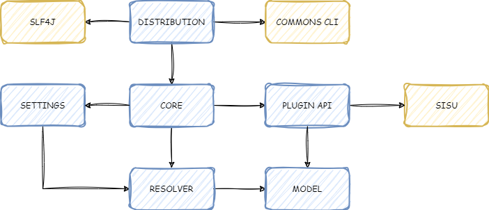
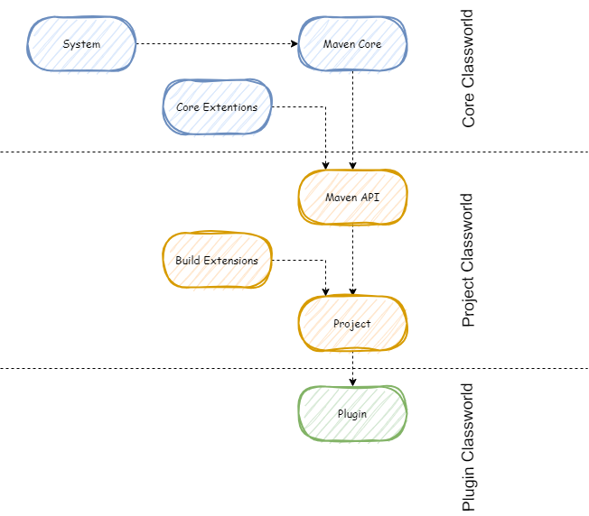

Deep dive into maven's internals to help the development of plugins

This will be probably the first post of a series about how maven works and how to contribute to its ecosystem.  
In this post, I will talk about the core components and internal mechanism of maven that developers should know if they want to develop plugins.
While developing my first plugins I have had a hard time to find all information in details in the documentations. I even ended up contributing to the maven documentations.
So the idea here is to give you important headlines and an introduction to the core features, and pointing you to detailed documentation links if you want to go further.

# Quick reminder
## What is MAVEN ?
[Maven](https://maven.apache.org/what-is-maven.html) is one of the most used build tools in the Java echo system. While helping us build our project, it does a lot more than just packaging it.  
You probably used a few of its plugins. Failsafe and Surefire plugins are most commonly used ones explicitly. 
But Maven is actually conceived with a plugin based architecture. Meaning everything you do with maven is running plugin.  
Even the basic commands you use, like `mvn clean install` are actually using `clean` and `install` plugins. See [here](https://maven.apache.org/plugins/index.html) for more details.
This is what allows maven to expand its usage so easily.  
You sometimes even use maven outside the build context, on your CI or deployment pipelines. `sonar-scanner` or `liquibase` plugins are good examples.

If you want to develop your own plugin to add new features to maven and use it on your CI or deployment pipelines, the official [documentation](https://maven.apache.org/plugin-developers/index.html) is always a good start.
You might find some pages out of date. Maven is an open sourced project developed mainly by the community. While writing this post, I am also trying to update it. Please do the same.
Also please have a look [here](https://maven.apache.org/plugin-developers/common-bugs.html), so you do not fell into common errors when starting with maven.


## How Maven works ?
You probably all know but I will repeat for the sake of introduction, everything starts by defining our maven build writing a `pom.xml`.  
We typically define the dependencies and resources we need to build our application, and the plugins/extensions we need part of our build process to do so.
```xml
<project xmlns="http://maven.apache.org/POM/4.0.0" xmlns:xsi="http://www.w3.org/2001/XMLSchema-instance"
         xsi:schemaLocation="http://maven.apache.org/POM/4.0.0 https://maven.apache.org/xsd/maven-4.0.0.xsd"
         child.project.url.inherit.append.path=.. >
<modelVersion/>

    <groupId>com.example</groupId>
    <artifactId>my demo app</artifactId>
    <version>1.0.0</version>
    <packaging>jar</packaging>
    
    <name>maven-demo-app</name>
    <description>an example of pom configuration</description>
    
    ...
    <dependencies>
        <dependency>
            <groupId/>
            <artifactId/>
            <version/>
        </dependency>
    </dependencies>
    ...

    <build>
        ...
        <resources>
            <resource>
                <directory/>
                <includes/>
                <excludes/>
            </resource>
        </resources>
       ...
        <plugins>
            <plugin>
                <groupId/>
                <artifactId/>
                <version/>
            </plugin>
        </plugins>
        ...
        <extensions>
            <extension>
                <groupId/>
                <artifactId/>
                <version/>
            </extension>
        </extensions>
    </build>

</project>
```

See [here](https://maven.apache.org/ref/3.9.6/maven-model/maven.html) for the full API.

When we launch a maven command, typically on cli:  
```shell
> mvn -help
usage: mvn [options] [<goal(s)>] [<phase(s)>]
```
Maven will read our pom.xml to see what we want to do, depending on what _command_ we have triggered.  
A **Goal** is simply an action made available via a **plugin**.  
A **Phase** is part of maven **Lifecycle**, and we can associate goals to a phase as we want.  
So using Lifecycles and phases we can trigger multiple goals to achieve what we want. A detailed explanation on Lifecycles can be found [here](https://maven.apache.org/ref/3.9.6/maven-core/lifecycles.html).    

For example when we launch `mvn install`, maven will launch a list of phases in a specific order that are part of the default lifecycle, and the plugin goals associated to each phase (by default or specified in our POM).
It will gather the sources and resources to build the classpath, compile the project, launch tests if any, package the app, and install it in our local repository.

As usually does all package managers, maven uses repositories to:
* Fetch the dependencies and plugins we need when building our own packages.
* Deploy our application when packaged

This is usually configured in a separate [config](https://maven.apache.org/ref/3.9.6/maven-settings/settings.html), 
the `settings.xml` which is specific to each environment and not published on version control, since it contains credentials to access the repository servers and local configs.

<div class="important">
    <div markdown="span" style="margin-left: 0.7em;">
        **Important:**
        <em>As we can understand from the above, there are multiple components interacting here to build our application. 
        Maven's core component is what orchestrates all this lifecycles logic, and each plugin is a separately packaged component.</em>
    </div>
</div>

---

# Inside Maven
Now that we have remembered how to use it, now lets get to the main subject and dig inside Maven to see how it works.

## 1. Maven Core
Maven is a command line tool, written in java and packaged as an executable that will run using your JRE.   
If you check the content of the `mvn` script that is actually launched when typing it on the cli, you will see that it is basically a bash script running a java process.  
```shell

exec "$JAVACMD" \
  $MAVEN_OPTS \
  $MAVEN_DEBUG_OPTS \
  -classpath "${CLASSWORLDS_JAR}" \
  "-Dclassworlds.conf=${MAVEN_HOME}/bin/m2.conf" \
  "-Dmaven.home=${MAVEN_HOME}" \
  "-Dlibrary.jansi.path=${MAVEN_HOME}/lib/jansi-native" \
  "-Dmaven.multiModuleProjectDirectory=${MAVEN_PROJECTBASEDIR}" \
  ${CLASSWORLDS_LAUNCHER} ${MAVEN_ARGS} "$@"

```

Without digging in too much details here, I will point you to the official documentation if you want further details.
The following [documentation](https://maven.apache.org/ref/3.9.6/) shows in details its internal components.  
<p></p>
This is highly simplified version that shows only the main components that we will talk about.
The <b style="color:steelblue">blue</b> boxes are the maven components and the <b style="color:sandybrown">orange</b> ones are external libraries used by maven. 

The **Distribution** is the full package we get when we download maven executables.  

The **Core** component is where we implement all the maven lifecycle and phase logic.
It interacts with the other components to get the information necessary to build the lifecycles (maven and project settings, plugin settings ect.).  
This is also where we have the Class Loader hierarchy and extensions setup for the maven lifecycles execution, which we will dig deeper further in this article.

The **PluginAPI** is basically where we make the interface between the maven lifecycles and the goals to execute from the plugins. We are going to use this API to code our plugins so maven can use them.
The [core](https://maven.apache.org/ref/3.9.6/maven-core/index.html) component on the schema is the main application that will manage everything necessary for the build process defined in your pom.xml.  
As you already guessed from the title of this article, we will talk in more details about this component further.

The **Settings** components is basically what you set in your maven settings, ` ~/.m2/settings.xml` plus the settings overridden on the cli.

The **Resolver** is a component for working with artifact repositories and dependency resolution. 
It deals with the specification of local repository, remote repository, developer workspaces, artifact transports, and artifact resolution.  

The **Model** is basically your model for Maven POM (Project Object Model), where you define your project settings.

The **SISU** components is where we manage the dependency injection of objects in maven plugins/extensions. It a crucial components in the plugin system, 
and we must understand how it works in case we are building extensions. 


## 2. Maven Classloader system
I will repeat it probably multiple times, but It is why I love maven, so I won't get tired of saying it: <em>maven is a plugin based system</em>.  

Lets quickly remind what is a classloader before explaining how maven uses it.  
A [ClassLoader](https://en.wikipedia.org/wiki/Java_Classloader) in java is a code that runs as part of the JRE, 
and it is responsible for finding the class files necessary for the execution of the application and load them in the JVM. 

Maven uses a classloading hierarchy to separates the class-worlds of its core, and its plugins. What that means is that, 
with this classloader hierarchy, we prevent exposing all the classes/packages used by the core, to the plugins.  
This level of isolation allows maven to work securely while allowing its extension by third party plugins developed by mere human beings like me, and preventing I break everything in it.  
<p></p>

Basically when booting maven, as we can see from the `mvn` script above, we launch the jar of the 
[plexus-classworld](https://codehaus-plexus.github.io/plexus-classworlds/) framework that is building this classLoader hierarchy, located in `${maven.home}/boot/plexus-classworlds-*.jar`.  
This creates the **System ClassLoader**. Then the different classLoaders are built, maven core, project and plugin classLoaders (there are actually more than that, but we will simplify for an introduction).

Content of this **Core Classloader** is configured in `${maven.home}/bin/m2.conf` and contains jars that constitutes a maven installation, located in `${maven.home}/lib/*.jar`. 
This core class loader hosts both the public API of Maven and internal utility classes. Core extensions classloaders use Maven Core classloader as the parent and have access to both exported and internal Maven Core classes. 

We can add other elements to this class loader via **[Core Extensions](https://maven.apache.org/examples/maven-3-lifecycle-extensions.html)**. 
Those classes will be available for maven core component, and all the plugins in the project through the child classloader Maven API.
We will talk more in details further how the extensions works. Each core extension is loaded in a separate classloader and there is no mechanism to share classes among core extensions.

The child class loader, **Maven API ClassLoader**, can only access the public Maven API from the core class loader, 
i.e. roughly only classes from the package org.apache.maven and its subpackages are available to the child class loader.

**Project ClassLoader** use Maven API classloader as the parent and import exported classes from project build extension realms. 
In case a project uses no build extensions and hence has no need for a dedicated project class loader, this class loader will technically not be created.

For each plugin used by a project, a **Plugin ClassLoader** is created as a child of the project class loader. If the project has no extensions and as such no project class loader, 
the plugin class loader will be a direct child of the Maven API ClassLoader instead.

A detailed documentation can be found [here](https://maven.apache.org/guides/mini/guide-maven-classloading.html#Core_Classloader) on the official website.


## 3. Maven Dependency Injection
Maven uses [**SISU**](https://projects.eclipse.org/projects/technology.sisu), which is a DI Container implementation based on the [Google Guice](https://code.google.com/p/google-guice/). 
It allows using standard [JSR330 annotations]() for declaring and injecting the objects we need in our classes.  
The [doc](https://eclipse.github.io/sisu.plexus/) here (that I have contributed) explains how to use the different annotations.

It basically allows you to inject components in your Mojo like the following:
```java
package org.apache.maven.plugins;

import javax.inject.Inject;

import org.apache.maven.plugin.AbstractMojo;
import org.apache.maven.plugin.MojoExecutionException;
import org.apache.maven.plugins.annotations.LifecyclePhase;
import org.apache.maven.plugins.annotations.Mojo;

@Mojo( name = "hello", defaultPhase = LifecyclePhase.VALIDATE, requiresProject = false )
public class MyMojo extends AbstractMojo
{

    private MyComponent component;

    @Inject
    public MyMojo( MyComponent component )
    {
        this.component = component;    
    }

    public void execute()
        throws MojoExecutionException
    {
        component.hello();
    }
}
```

According to the documentation, in order to be able to use the `MyComponent`, we have to annotate it with JSR330.
```java
@Named
@Singleton
public class MyComponent
    implements Component
{
}
```

<div class="alert">
    <div markdown="span" style="margin-left: 0.7em;">
        <!--<svg xmlns="http://www.w3.org/2000/svg" width="16" height="16" fill="currentColor" class="bi bi-exclamation-triangle-fill" viewBox="0 0 16 16">
            <path d="M8.982 1.566a1.13 1.13 0 0 0-1.96 0L.165 13.233c-.457.778.091 1.767.98 1.767h13.713c.889 0 1.438-.99.98-1.767L8.982 1.566zM8 5c.535 0 .954.462.9.995l-.35 3.507a.552.552 0 0 1-1.1 0L7.1 5.995A.905.905 0 0 1 8 5zm.002 6a1 1 0 1 1 0 2 1 1 0 0 1 0-2z"/>
        </svg>--> 
        **But** I have discovered that it is also capable of injecting simple POJOs using their default constructor, even if the `@Named` or `@Singleton` annotations are not used.
    </div>
</div> 

The official [documentation](https://maven.apache.org/maven-jsr330.html) gives a brief introduction to how maven uses it, and what to do to make the annotations work if you want to use them in your plugin or extension.  
The important thing to catch here, is the usage of the [sisu-maven-plugin](https://eclipse.org/sisu/docs/api/org.eclipse.sisu.mojos/) in your project.  This will add your components to the index file so they are picked up by the SISU container.
From the docs:
<blockquote>
Enumerating the implementations means that no classpath scanning is required in runtime to find them, which keeps Maven's startup time fast. Note that our container is configured by default to only use the index. While this keeps things fast, if you use JSR-330 components in dependencies that do not contain an index, those implementations will currently not be discovered. This is a compromise that is reasonable given Maven is a command-line tool where startup speed is important.
</blockquote>

If you are interested in injecting components in the container dynamically, I unfortunately no other documentation other than [this](https://github.com/eclipse/sisu.plexus/issues/35) long issue I have filled myself.
You can also take example of this [plugin](https://github.com/HomeOfTheWizard/spring-bridge-maven-plugin) I have developped to achieve the same.

## 4. Maven Plugins  
When we execute a goal in maven, this points to a plugin's code. Plugins consists of one or more **Mojos**, each one being the implementation for one of the plugin's goals.
A Mojo is basically the API to use when coding your plugin, so that maven can use it.
I will not go into too much details here since there are already hundreds of articles/posts online, 
including the [official documentation](https://maven.apache.org/ref/3.9.6/maven-plugin-api/index.html), describing how to create a Mojo, build and package your plugin.


## 5. Maven Extensions
Extensions are basically a way to add new features to maven core or to your project build lifecycle, by adding new classes to the different class loaders explained above. 
This allows us to insert code that will impact multiple plugins at once.  

There are two types of extensions:
1. **Core extensions** are loaded as part of Maven runtime startup and disposed of as part of Maven runtime shutdown.
2. **Build extensions** are loaded lazily during the build of your project.

Difference between late and early registration refers to which class-world will it be part of. Early registration simply means that the extension will be used when maven core bootstraps. Late registration means that the extension will be used only after maven core is launched, our project model is built and our the built lifecycle has begun.

### 5.1. Core Extensions
Core Extensions is a new mechanism introduced in Maven 3.3.0 which allows additional components to be loaded into Maven Core as part of a build session.
As already seen above, each core extension is loaded in a separate classloader and there is no mechanism to share classes among core extensions. Core extensions classloaders use Maven Core classloader as the parent and have access to both exported and internal Maven Core classes.

From the [official documentation](https://maven.apache.org/guides/mini/guide-using-extensions.html):
<blockquote>
The mechanism allows extensions to either replace default Sisu components with custom ones or add new components which are used at run time. In addition one could also expose additional packages from the Core Classloader.
</blockquote>

What I want to highlight here is the mention: _"one could also expose additional packages from the Core Classloader"._  
Core extension can use [META-INF/maven/extension.xml](https://maven.apache.org/ref/3.9.0/maven-core/core-extensions.html) descriptor (which declares what packages are exported from maven core to extensions) 
to declare packages and artifacts exported by the extension. If the descriptor is not present, no packages or artifacts are exported, but the extension can still contribute components to Maven Core extension points.

Core extensions are configured in `${maven.projectBasedir}/.mvn/extensions.xml` configuration file.
```xml
<?xml version="1.0" encoding="UTF-8"?>
<extensions>
  <extension>
    <groupId>...</groupId>
    <artifactId>...</artifactId>
    <version>...</version>
  </extension>
  <extension>...</extension>
  ...
</extensions>
```

### 5.2. Build Extensions
From the [docs](https://maven.apache.org/pom.html#Extensions):
<blockquote>
Extensions are a list of artifacts that are to be used in this build. They will be included in the running build's classpath. 
They can enable extensions to the build process (such as add an ftp provider for the Wagon transport mechanism), as well as make plugins active which make changes to the build lifecycle. 
In short, extensions are artifacts that activated during build. The extensions do not have to actually do anything nor contain a Mojo. 
For this reason, extensions are excellent for specifying one out of multiple implementations of a common plugin interface.
</blockquote>

Those extensions are typically used to enable Wagon providers, used for the transport of artifact between repositories, and plug-ins which provide lifecycle enhancements.    
Example:
```xml
<build>
    <extensions>
      <extension>
        <groupId>org.apache.maven.wagon</groupId>
         <artifactId>wagon-ftp</artifactId>
         <version>2.10</version>
      </extension>
    </extensions>
  </build>
  ```
Build extensions are registered (late registration) via your `pom.xml`. Examples can be found [here](https://maven.apache.org/guides/mini/guide-using-extensions.html#build-extension)

---

# RECAP
In this post I have tried to cover all the core components and internal mechanisms in maven that I found important to understand for a developer who wants to contribute to maven with a plugin or extension.  

The distinction and interaction between the **Core and the Plugin API** is an important point to understand when we want to pinpoint which component we need to target for a new feature or fix.  
The **Classloader system** is what builds the boundaries between the core and plugins. Its understanding is crucial in order to prevent hours wasted trying to build our new project.  
Finally, the **SISU** container, which is at the core of maven, is and important component to understand if we want to build reusable components and build transverse features.

Hope that helps you in your journey. Next post will probably be on the maven core. Stay tuned ! 🖖

---

<h1>Appendix: References</h1>

https://maven.apache.org/what-is-maven.html
https://maven.apache.org/plugins/index.html
https://maven.apache.org/plugin-developers/index.html
https://maven.apache.org/plugin-developers/common-bugs.html
https://en.wikipedia.org/wiki/Java_Classloader
https://maven.apache.org/guides/mini/guide-maven-classloading.html#Core_Classloader
http://takari.io/book/91-maven-classloading.html
https://cwiki.apache.org/confluence/display/MAVEN/Maven+3.x+Class+Loading
https://eclipse.github.io/sisu.plexus/
https://developer.okta.com/blog/2019/09/23/tutorial-build-a-maven-plugin
https://maven.apache.org/guides/mini/guide-using-extensions.html
 

