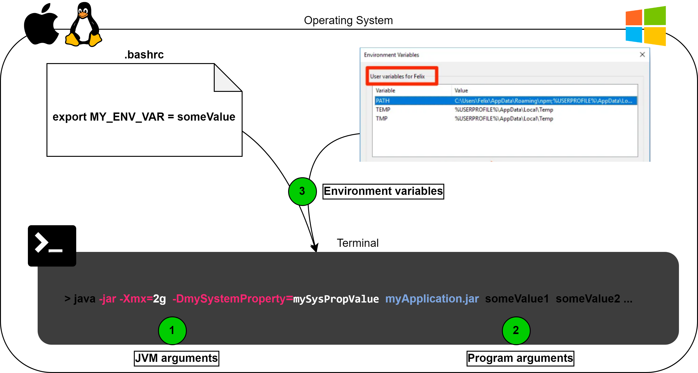
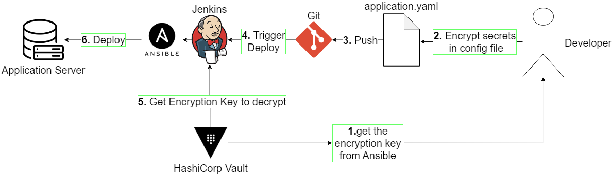
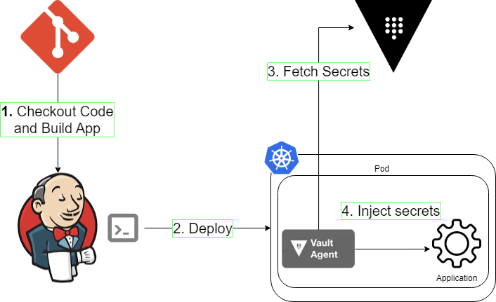

This post gives an overview of the different ways to manage configuration parameters for software applications in general, and focuses on the management of secrets with environment variables for applications written in java.

All modern production applications have some parameters/configurations to allow maximum flexibility of its execution. 
There are different ways to manage those parameters, as there are different type of parameters, 
as there are different type of processes/applications that can run as on a Server. 
We will cover all those type of parameters, for the scope of a java application, in detail further below this post. 
The catch here is that the parameters of an application is usually managed separately than the code that will be packaged as the executable.  
A good reading about the why's and how's is the post from <strong>[12 factor app](https://12factor.net/config)</strong>  
  
Many applications today manages some configuration/parameters that needs to be kept secret, aka <em>secrets</em>. 
Sometimes it is the credentials to access a DB, some other times it is the key to encrypt a communication with another application. 
Different from other parameter/config, these values must be stored and managed by the application carefully in order to prevent their leak.    
  
First lets see the different ways to pass application parameters in a java, then we will focus on the best practices to do so for secrets specifically.  

<h1> Arguments ? Properties ? Variables ? </h1>
As a junior, or even an experienced developer you may sometimes confuse one for the other if you never had to deal with the subtle differences.
We will cover all those in details, and have a resumé of differences at the end.

<h3>1. Program Arguments</h3>
Program arguments in java are the parameters you provide when running your java application. They are also called command-line arguments. Here is how you can use it:  

Lets say you have a main class like so;

public class Echo {
    public static void main (String[] args) {
        for (String s: args) {
            System.out.println(s);
        }
    }
}


Now, when you package your application as a jar, and you run it, you can pass arguments like so:

java -jar MyApplication.jar paramStr1 paramStr2


The arguments you pass after the jar file will be given to your main method as String parameters.   
If you want to change the type of the argument, you need to parse or cast the String object.  
Since we are talking about running our application in command line, only String parameters makes sense in that context.  

<h3>2. JVM arguments</h3>
When we execute a java program from the command line, using the <code>java</code> executable from the JRE lib, we can pass multiple <em>Options</em> to the JVM.   
The <code>java -jar</code> option is only one of them.

It is easy to confuse them with Program arguments, since they are also sometimes called <em>JVM arguments</em>.
Different from Program args, JVM args are passed to the JVM directly and are meant to modify its behaviour. The most known usage is to set the maximum Heap size <code>-Xmx</code> flag.

java -jar -Xmx=2g MyApplication.jar paramStr1 paramStr2


A full list of options for the Hotspot JVM is available [here](https://docs.oracle.com/javase/8/docs/technotes/tools/windows/java.html) along the standard options that are general to all JVMs.

<h3>3. System Properties</h3>
A specific type of JVM argument allows you to set the properties of the JVM, called [System Properties](https://docs.oracle.com/javase/tutorial/essential/environment/sysprop.html). 
Note that <code>-DsystemProperty1=myStrPropValue</code> below is a JVM argument given with the <code>-D</code> flag.

java -jar -DmySystemProperty=mySysPropValue MyApplication.jar paramStr1 paramStr2


Those properties are available from all applications and sub-processes running in the JVM execution. Some predefined properties gives info about the current execution context of your JVM. They can be used in a Java application like so:

var sysProps = System.getProperty();
var pathSeperator = sysProps.get("path.separator");
sysProps.setProperty("myCustomProperty", "myPropertyValue);


Beware that setting new Properties or overriding an existing one will be persistent only during the current execution of the JVM and will be deleted once JVM shuts down.
System Properties, like all [Properties](https://docs.oracle.com/en/java/javase/17/docs/api/index.html) objects are mere objects available in the Heap and their value is not persisted anywhere on the disk.  

<h3>4. Environment Variables</h3>
Environment variables are nothing specific to Java. They are actually set outside the context of our JVM execution. 
They are variables defined on the OS level and are available to all processes (unless we define availability constraints on them).
They are available in all Linux based systems and Windows (with subtle differences). You can this [wiki page](https://en.wikipedia.org/wiki/Environment_variable) or this [blog post](https://www.twilio.com/blog/how-to-set-environment-variables.html) how to set them. 

We can access and use them in java applications like so:

var envVars = System.getenv();
var shell = envVars.get("SHELL");
System.out.println("The current Shell type is: " + shell);
System.out.println("The current Operating System is: " + System.getenv("OS"));


<em>Keep in mind that different platforms operate in different ways. E.g., on UNIX, Linux, and macOS, environment variables are case-sensitive, whereas on Microsoft Windows they are not.</em>

<em>In a java application, we can use environment variables available to our JVM process. But Java does not have a standard way to modify its environment. This is a decision taken to make the language and application portable. and its design isolated from its execution environment.</em>

<h3>5. Properties specific to Frameworks</h3>
If you are using spring or maven, you probably heard about things like (respectively) application properties or project properties.

<h6>Spring application properties</h6>
The best description comes from the official [docs](https://docs.spring.io/spring-boot/docs/current/reference/html/features.html#features.external-config):
<blockquote>

Spring Boot lets you externalize your configuration so that you can work with the same application code in different environments. You can use a variety of external configuration sources including Java properties files, YAML files, environment variables, and command-line arguments.

Property values can be injected directly into your beans by using the @Value annotation, accessed through Spring’s Environment abstraction, or be bound to structured objects through @ConfigurationProperties.

</blockquote>

As described above the @Value/@ConfigurationProperties annotations allow you to use these application parameters in your code. The most commonly used way of defining those parameters is an application.properties/.yaml file. But it is not the only way. Spring have multiple ways/places to define those properties and with an order of priority to allow overriding one defined in another. You can find the detailed list of hierarchy in the official documentation.    
One of them that you should not confuse with System properties, are spring program arguments. You can add application properties them from cli like so `java -jar mySpringApp.jar --someProperty=someValue` (see [here](https://docs.spring.io/spring-boot/docs/current/reference/html/features.html#features.external-config.command-line-args) for more details).   
  
The already explained configuration parameters like JVM arguments, system properties and environment variables can be sourced to define the spring application properties and used via the respective annotations. 


@Value("#{systemEnvironment['MY_SECRET']}") // via environment variables
private String s1;

@Value("#{systemProperties['myApp.mySystemProperty']}") // via System properties passed in cli:  java -jar -DmyApp.mySystemProperty=someVal mySpringApp.jar 
private String s2

@Value("${myApp.myAppProperty:aDefaultValue}") // via application.property file or other PropertySource definition
private String s3;


if you are using spring boot, you can directly use the following syntax to access env variables and system properties


@Value("${MY_SECRET:aDefaultValue}")
private String s1;
@Value("${myJVM.mySystemProperty:aDefaultValue}")
private String s2;


Or a cleaner and simpler way, just define them in the same place as other application properties, like in your application.properties/.yaml file
Then access those properties via the @Value annotation with a simpler expression.


myApp.mySecretIndirect=${MY_SECRET:aDefaultValue}
myApp.mySysPropIndirect=${myJVM.myProperty:aDefaultValue}
myApp.myAppProperty=SomeValue


<h6>Maven properties</h6>
Again from the official [docs](https://maven.apache.org/pom.html#properties):
<blockquote>

Maven properties are value placeholders, like properties in Ant. Their values are accessible anywhere within a POM by using the notation ${X}, where X is the property. Or they can be used by plugins as default values

</blockquote>


<project>
  ...
  <properties>
    <maven.compiler.source>1.7</maven.compiler.source>
    <maven.compiler.target>1.7</maven.compiler.target>
    <!-- Following project.-properties are reserved for Maven in will become elements in a future POM definition. -->
    <!-- Don't start your own properties properties with project. -->
    <project.build.sourceEncoding>UTF-8</project.build.sourceEncoding> 
    <project.reporting.outputEncoding>UTF-8</project.reporting.outputEncoding>
  </properties>
  ...
</project>


And again like the above spring properties, maven properties can as well be sourced from the basic java configuration parameters like JVM arguments, system properties and environment variables.  
Once defined (like already explained above), you can use them with the below syntax.


<properties>
    <!-- environment variable -->
    <myApp.githubPAT>${env.MY_GITHUB_PAT}</myApp.githubPAT>
    <!-- JVM system properties -->
    <myApp.javaPath>${java.home}</myApp.javaPath>
    <myApp.OS>${os.name}</myApp.OS>
    <!-- JVM System properties , you can give custom ones on cli "mvn -DmyApp.logging.path=... clean install" and access them in pom like normal properties -->
    <myApp.logging.file>${myApp.logging.path}/myApp.log</myApp.logging.file>
    <!-- maven predefined properties -->
    <myApp.execId>myApp-${maven.build.timestamp}</myApp.execId>
    <jacoco.unit.file>${project.build.directory}/jacoco-unit.exec</jacoco.unit.file>
    <!-- user defined property -->
    <version.jacoco>0.8.7</version.jacoco>
    <version.jacoco.plugin>${version.jacoco}</version.jacoco.plugin>
</properties>


If you are interested in going more into the details of maven, the blog post [here](./maven_sisu) is a good article to start with.

<h3>6. Resumé </h3>
If we take those words and analyse the literal meanings outside the scope of programming, we already have a hint of their differences.  
[Arguments](https://en.wikipedia.org/wiki/Command-line_interface#Arguments) ?  Short for "arguments of a command line expression".   
[Properties](https://www.oxfordlearnersdictionaries.com/definition/american_english/property#:~:text=1%5Buncountable%5D%20a%20thing%20or,intellectual%20property%2C%20public%20property%20Thesaurus) ? They are values that defines something.  
[Variables](https://www.oxfordlearnersdictionaries.com/definition/english/variable_1?q=variable) ? Something that can change outside our will.  

<ol>
<li>Program Arguments: String Parameters we pass to our main method. Must be given set startup.</li> 
<li>JVM Arguments: Options that affect how the JVM operates. Must be given set startup.</li> 
<li>System Properties: Value/Keys available in every application running in the JVM. Can be set via command line, or by the code of the java application.</li>
<li>Environment Variables: Values that are set outside the execution of the JVM and cannot be changed by the JVM.</li>
</ol>

<h1> Secrets ?</h1>
Now lets get back to the focus element of this post. The credentials in our configuration, aka. secrets.
There are different methods to give secret values as parameters to an application.

<h3> Basic and old way </h3>
Is to have the credentials stored in a configuration file, located only on a server we consider secure, and we limit all access to it. Like the production server.
For applications that run directly on bare metal or VMs without orchestration, this is most often the chosen method.

Just to give a glimpse of best practices used on non containerized environments, without diving into too much details since they are less and less used in modern systems,
if you are using deployment tools like ansible, you can profit from features like [Ansible Vault](https://docs.ansible.com/ansible/latest/vault_guide).

Ansible vault allows you to encrypt them with a key so your secret file that is encrypted may even be pushed on version control.
It will then decrypt them on the fly during deployment.
So only the decryption key is needed to be managed during the deployment and execution of the application.
The encryption key is the real secret here and can be stored in your CI tool that will launch the deployments, or you can use a secret manager like [Hashicorp Vault](https://www.vaultproject.io/) to keep your secrets.  

Application execution environments are considered as not secure since it is a place we do regular changes. Lots of ins and outs, difficult to track and secure.
This is why key management applications, like HashiCorp Vault has come into being. Their only purpose is to store your secrets. They also allow you to keep your secrets in a central place without copy pasting it everywhere.  
For example most CI tools, like jenkins have [plugins](https://plugins.jenkins.io/hashicorp-vault-plugin/), allowing to communicate with HashiCorp Vault to fetch your secrets during your pipeline execution instead of storing them on the CI server.

    

        <!--<svg xmlns="http://www.w3.org/2000/svg" width="16" height="16" fill="currentColor" class="bi bi-exclamation-triangle-fill" viewBox="0 0 16 16">
            <path d="M8.982 1.566a1.13 1.13 0 0 0-1.96 0L.165 13.233c-.457.778.091 1.767.98 1.767h13.713c.889 0 1.438-.99.98-1.767L8.982 1.566zM8 5c.535 0 .954.462.9.995l-.35 3.507a.552.552 0 0 1-1.1 0L7.1 5.995A.905.905 0 0 1 8 5zm.002 6a1 1 0 1 1 0 2 1 1 0 0 1 0-2z"/>
        </svg>--> 
        Warning:
        <em>The most secure way to manage secrets is to not persist them at all anywhere apart we consider secure.
        Also, duplicating the places where you persist the secret widens the attack surface and increase the risk of leak of the secret.</em>
    

<h3> In containerized environments </h3>

When we want to leverage from the advantages of containers (such as flexible scalability) we usually run multiple instances of our application. Hence, the secrets must be available to all the instances.
Most known Container Execution Environment Providers like Docker and Kubernetes has components ([etcd](https://kubernetes.io/docs/concepts/configuration/secret/) for K8s) that are considered relatively secure to store the secrets for you, and make them available to all your instances.

Kubernetes has even direct [integration](https://www.vaultproject.io/use-cases/kubernetes) with HashiCorp Vault that allows fetching the secrets from Vault and injecting into the pods, instead of storing them in own DB (etcd).
The only thing to manage in the execution environment is the credentials to access to Vault.  

Vault has several different integration tools with K8s, each having their pros and cons, discussed [here](https://www.hashicorp.com/blog/kubernetes-vault-integration-via-sidecar-agent-injector-vs-csi-provider).  
The key challenge when we have multiple instances, and we want to centralize the management of the secrets in a single component (vault), is to keep the secrets used by the instances fresh and in sync with vault.  
Another challenge is about how the application will react to and handle a secret change. This is where framework specific solutions like [spring-cloud-vault](https://cloud.spring.io/spring-cloud-vault/reference/html/) comes into play.  

Now all those options also differ in an important way, which is how do they make the secrets fetched from vault available to the application.

<h3> The use of secrets fetched from Secret Manager </h3>
Tools/solutions specific to kubernetes either share the secrets in a file or as environment variable to the application.

Compared to bare-metal servers or VMs, containers have the advantage of being ephemeral which in turns makes the fact of having the secrets accessible on the execution environment a bit more secure.
Making them accessible via environment variables, instead of a config file persisted on the FS, is considered relatively more secure.
There are still some concerns about this approach in general ( [one](https://www.cloudtruth.com/blog/the-pitfalls-of-using-environment-variables-for-config-and-secrets) or [two](https://www.trendmicro.com/en_za/research/22/h/analyzing-hidden-danger-of-environment-variables-for-keeping-secrets.html) among other tones of discussion on platforms like stackexchange and stackoverflow, of blog posts are available on the net)

Another problem about making the secrets available via plain text file or environment variable, is the [castle and moat](https://www.cloudflare.com/learning/access-management/castle-and-moat-network-security/) problem.
We can never be sure that our K8s cluster will not be accessed by an attacker. Hence, the importance of mutual TLS and emergence of zero-trust solutions like [istio](https://istio.io/latest/docs/concepts/security/).

Frameworks like [spring-cloud-vault](https://cloud.spring.io/spring-cloud-vault/reference/html/) or tools like [maven-vault-plugin](https://homeofthewizard.github.io/vault-maven-plugin/) allows the JVM to fetch the secrets directly from the HashiCorp Vault. Your secrets are not persisted anywhere, but exists only in memory of your application.  
They are pure Java solutions, so you do not have to install anything specific to the execution environment, hence can be used even in development environments.  
Of course those solutions also have their downsides. Spring-cloud asks you to change your codebase and requires you to manage an additional config server, while vault-maven-plugin adds the overhead of a build tool to the execution of your app.

<h1> Résumé </h1>
Fist We have discussed how parameters in general are passed to a java application, as well as secrets.

* Program Arguments
* System Properties
* Environment variables

Then we have saw the importance of the usage of secret managers. Allowing us to centralise the management of our secrets and automate the integration with the different environments our application runs.

Lastly we saw the different options we have when using the HashCorp vault secret manager, and pointed to the key challenges and important points to consider when choosing one.  

**Final words**: There is no single solution that fits all. Every project has different requirements and priorities. So we have to consider the pros and cons of each solution to select the best for us.

  

Hope all that was useful for you!

--- 

<h1> Appendix: References </h1>
https://docs.oracle.com/javase/8/docs/technotes/tools/windows/java.html    
https://docs.oracle.com/javase/tutorial/essential/environment/index.html  
https://docs.oracle.com/en/java/javase/17/docs/api/java.base/java/util/Properties.html    
https://7factorconfig.org/   
https://12factor.net/   
https://www.twilio.com/blog/working-with-environment-variables-in-java
https://betterdev.blog/command-line-arguments-anatomy-explained/
https://developer.hashicorp.com/vault/docs/agent-and-proxy/agent  
https://security.stackexchange.com/questions/197784/is-it-unsafe-to-use-environmental-variables-for-secret-data  
https://docs.spring.io/spring-boot/docs/current/reference/html/features.html#features.external-config  
https://docs.spring.io/spring-framework/reference/core/beans/annotation-config/value-annotations.html  

